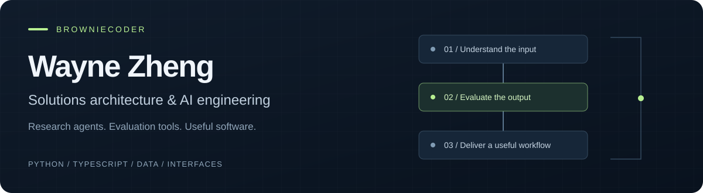

  

  <strong>Solutions architecture · AI systems · Full-stack development</strong> 
  <a href="mailto:contact@waynezheng.dev">Get in touch</a> ·
  <a href="https://github.com/BrownieCoder?tab=repositories&amp;type=source">Explore my projects</a>

I'm a **Solutions Architect and hands-on AI engineer**. I translate business workflows into system designs, weigh build-versus-buy decisions, and build the applications and integrations that put those designs to work.

My projects span research automation, evaluation dashboards, browser tools, and full-stack applications, connecting **messy inputs, AI models, and useful workflows**.

I care about the parts that make these systems dependable: validated outputs, reviewable context, explicit state, and recovery when a step fails.

## Selected work

| Project | What to look for | Stack |
| :--- | :--- | :--- |
| **[Agent Lens](https://github.com/BrownieCoder/agent-lens)** | Compare report quality across prompt versions. Inspect human review, judge calibration, and cost/latency tradeoffs. | Python · FastAPI · React |
| **[Signal Workbench](https://github.com/BrownieCoder/signal-workbench)** | Run an offline research pipeline with synthetic crypto evidence, proposal validation, budget fallback, and resumable local delivery. | Python · SQLite |
| **[Reply Copilot](https://github.com/BrownieCoder/reply-copilot)** | AI writing assistance inside the browser, with reviewable context, explicit site access, and protection against overwriting newer drafts. | JavaScript · Chrome MV3 |
| **[CloseLoop](https://github.com/BrownieCoder/closeloop)** | A decision-management PWA with explicit state transitions, preserved reasoning, and separate data/asset caching. | TypeScript · React · D1 |

Also building **[Agent Title Renamer](https://github.com/BrownieCoder/agent-title-renamer-skill)**: a portable skill for keeping AI conversation titles useful and consistent.

## How I work

- **Make behavior inspectable.** Small modules, documented decisions, and examples you can run locally.
- **Test the failure paths.** Invalid model output, stale editor state, interrupted delivery, and data boundaries deserve explicit handling.
- **Connect architecture to delivery.** System boundaries, integration choices, APIs, and data pipelines through to the interface people use.

**Tools I reach for:** Python, FastAPI, SQLAlchemy, SQLite, TypeScript, React, Chrome extensions, Cloudflare Workers, D1, and GitHub Actions.

## Let's build something useful

Open to **remote opportunities** in solutions architecture, AI applications, research tooling, data automation, and full-stack development. Comfortable with asynchronous collaboration in English and Mandarin.

**[contact@waynezheng.dev](mailto:contact@waynezheng.dev)**

Steady iteration: 500+ GitHub contributions in 2026 as of September 15, including private work. Public repositories here are selected examples; each documents its own scope and limitations.
